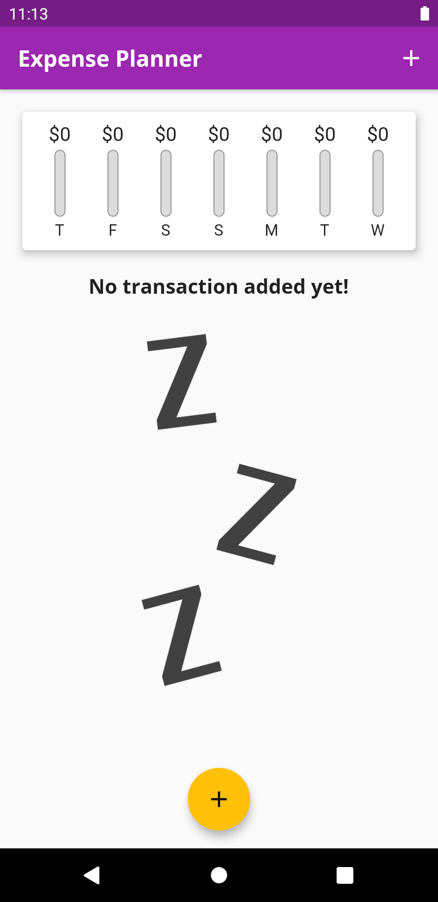
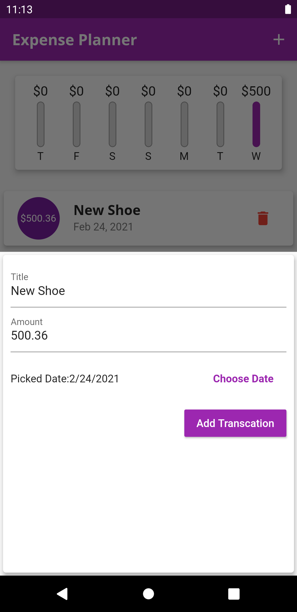
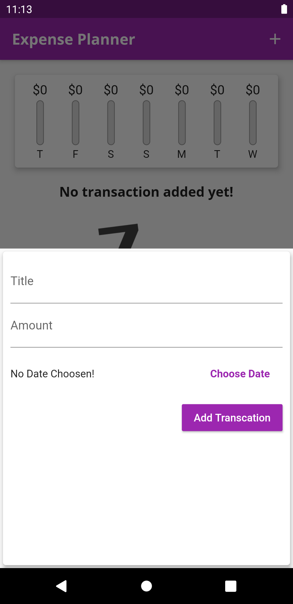
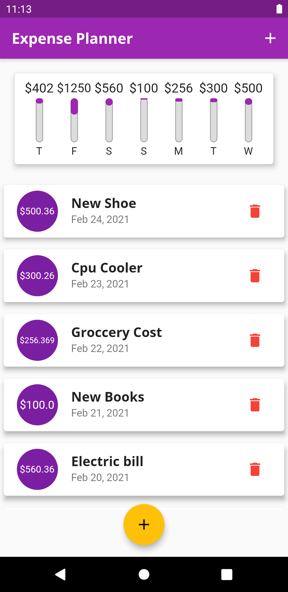
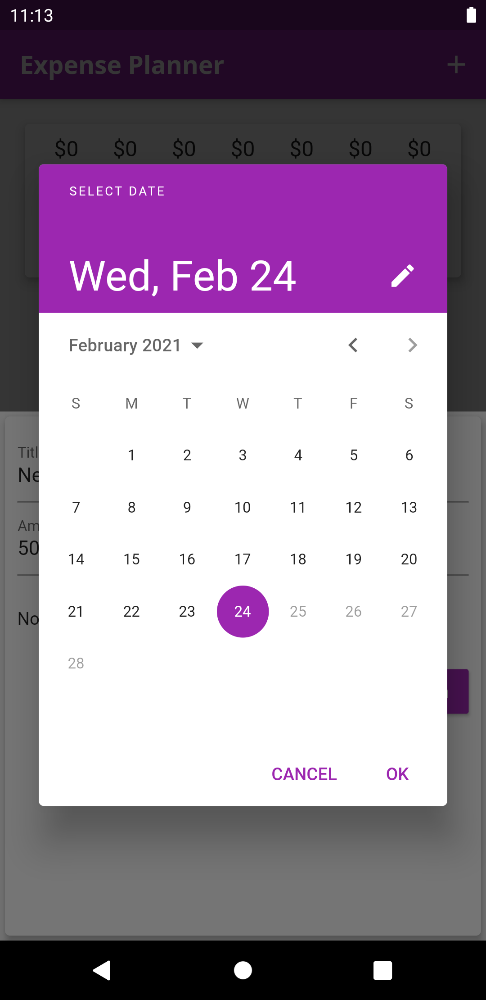

# Budget Tracker Application

## In this app an user can
 - keep track his/her daily expenses
 - He/she can add expense title , amount , and which date they expense
 - He/she can delete any particular budget list
 - A beautiful bar chart represent the last week expenses of the user.
 -  And in future some more feature will added on this app, and also the UI will be updated.
 
 
 ## Some screenshots

|                                      |                                      |
| ------------------------------------ | ------------------------------------ |
|  |  |
|   |   |
|   |

## Getting Started

This project is a starting point for a Flutter application.

A few resources to get you started if this is your first Flutter project:

- [Lab: Write your first Flutter app](https://flutter.dev/docs/get-started/codelab)
- [Cookbook: Useful Flutter samples](https://flutter.dev/docs/cookbook)

For help getting started with Flutter, view our
[online documentation](https://flutter.dev/docs), which offers tutorials,
samples, guidance on mobile development, and a full API reference.
